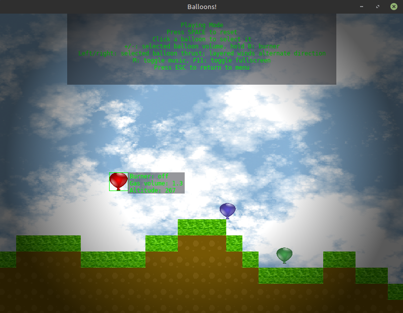
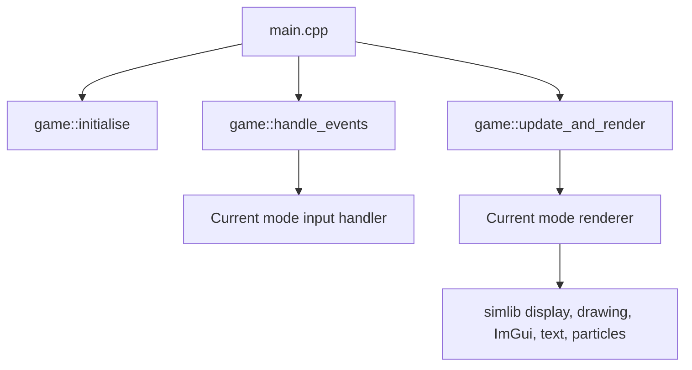

# simlib

`simlib` is a small Allegro 4-style 2D game/rendering library built on SDL2 and
OpenGL, with bitmap drawing primitives, TrueType text rendering, SDL_mixer
audio, a shader/effects layer, ZIP resource archives, Perlin/simplex noise,
and a sandboxed embedded Lua console (via [sol2](https://github.com/ThePhD/sol2)).

> **Experimental software:** simlib is under active development and expected to
> grow organically. APIs, behavior, and project structure may change as the
> library evolves.

This repository contains:

- **`simlib`** — the static engine library (`src/engine/`).
- **`sltest`** — a sample game/test application built on `simlib`, with a
    menu, simple physics/entity system, and Lua REPL console (`src/applications/sltest/`).
- **`slpack`** — a CLI tool for packing assets into ZIP archives (`src/applications/slpack/`).
- **`exhello`** — a minimal "hello world" example (`src/applications/exhello/`).
- **`exfont`** — a proportional and monospace TrueType comparison (`src/applications/exfont/`).
- **`exrotatesprite`** — a continuously rotating sprite example (`src/applications/exrotatesprite/`).
- **`exlighting`** — radial multi-light and rectangle-shadow example (`src/applications/exlighting/`).

### `sltest` screenshot

The sample game's physics playground, including its balloon controls, terrain,
particles, and vignette effect:



## Prerequisites

- CMake 3.16+
- A C++17 compiler
- SDL2, SDL2_ttf, SDL2_image, SDL2_mixer (development packages)
- OpenGL, libpng, zlib

On Debian/Ubuntu:

```bash
sudo apt install cmake build-essential libsdl2-dev libsdl2-ttf-dev \
    libsdl2-image-dev libsdl2-mixer-dev libpng-dev zlib1g-dev libgl1-mesa-dev
```

Dear ImGui, Lua, and sol2 are fetched automatically via CMake's `FetchContent`
— no manual setup required.

## Building

```bash
cmake -S . -B build
cmake --build build
```

This produces the application executables in the repository root, including
`sltest`, the example programs, `slpack`, and `slunpack`. Test executables are
created in the `build/` directory when testing is enabled.

To run the test suite (currently covers the ZIP resource archive reader):

```bash
cmake --build build --target resource_test
ctest --test-dir build
```

## Running the examples

```bash
./exhello   # minimal window + text rendering demo
./exfont    # proportional and monospace TrueType font demo
./exrotatesprite # rotating sprite demo
./exlighting # radial lights and rectangle shadows demo
./sltest    # sample game: menu, physics playground, Lua console
./slpack    # pack files into a ZIP resource archive
```

In `sltest`, press `4` from the menu to open the embedded Lua console —
type `quit()` to exit, `os.clock()` / `os.time()` for the sandboxed clock,
or press `ESC` to return to the menu.

## Quick start

A minimal application only needs `sl.h`, which pulls in the whole public API:

```cpp
#include "sl.h"

int main()
{
    if (!sl::set_gfx_mode(sl::GFX_AUTODETECT_WINDOWED, 800, 600))
    {
        return -1;
    }
    sl::Event event;
    bool running = true;
    while (running)
    {
        while (sl::poll_event(&event))
        {
            if (event.type() == sl::Event::Type::quit)
                running = false;
            sl::display_handle_event(event);
        }

        sl::clear_to_colour(sl::screen, sl::Colour{146, 200, 62});
        // ... draw your frame ...
        sl::show_video_bitmap();
        sl::end_frame();
    }
}
```

Link your CMake target against the `simlib` library target:

```cmake
add_executable(my_app src/my_app.cpp)
target_link_libraries(my_app PRIVATE simlib)
```

## Core API reference

Include `sl.h` to access the complete public API, or include an individual
header when you only need one subsystem. The functions below are the main
entry points for a typical 2D application.

### Application lifecycle and display

| Function | Description |
| --- | --- |
| `set_gfx_mode(driver, width, height, virtualWidth, virtualHeight)` | Create the SDL/OpenGL window and initialize the display bitmap. Use `GFX_AUTODETECT_WINDOWED` for the default windowed driver. |
| `display_handle_event(event)` | Apply display-related events, including window resizing. Call for every polled event. |
| `set_window_title(title)` | Set the native window title. |
| `set_fullscreen(enabled)` / `toggle_fullscreen()` | Enter, leave, or toggle desktop fullscreen mode. |
| `set_vsync(enabled)` | Enable or disable the OpenGL swap interval. |
| `screen_width()` / `screen_height()` | Return the current drawable dimensions in pixels. |
| `virtual_screen_width()` / `virtual_screen_height()` | Return the configured logical drawing dimensions. |
| `clear_to_colour(red, green, blue, alpha)` | Clear the current display framebuffer. |
| `show_video_bitmap()` | Present the current framebuffer to the window. |
| `display_shutdown()` | Release the window, OpenGL context, and display resources. |

A normal frame calls `show_video_bitmap()` once, followed by `end_frame()`.
Call `display_shutdown()` before `sl::shutdown()` during application cleanup.

### Events, input, and timing

| Function | Description |
| --- | --- |
| `poll_event(&event)` | Remove the next event from the queue; returns `false` when the queue is empty. |
| `key_down(scancode)` | Test whether a keyboard scancode is currently held. |
| `mouse_x()` / `mouse_y()` | Return the current mouse position in window pixels. |
| `mouse_buttons()` | Return the current mouse-button bitmask. |
| `time_ms()` | Return elapsed milliseconds from SDL's monotonic timer. |
| `set_fps(fps)` / `get_fps()` | Set or read the target frame rate; `0` means uncapped. |
| `get_frame_time()` | Return the duration of the last completed frame in milliseconds. |
| `end_frame()` | Finish a frame, maintain the configured frame rate, and record frame timing. |
| `rest(milliseconds)` | Delay execution for approximately the requested duration. |

`Event` is the backend-independent event type. Inspect `event.type()` for the
event category, `event.key()` for normalized keyboard input, and the other
event accessors for payloads. Forward each event to `display_handle_event()`
when using a windowed application.

### Bitmaps, render targets, and drawing

| Function | Description |
| --- | --- |
| `create_bitmap(width, height)` | Create a RAM-backed RGBA bitmap. |
| `create_video_bitmap(width, height)` | Create a GPU-backed bitmap. |
| `create_render_target(width, height)` | Create a GPU bitmap that can receive drawing commands as an offscreen framebuffer. |
| `begin_render_target(target)` / `end_render_target()` | Redirect drawing to an offscreen target, then restore drawing to the window. |
| `clear_render_target(colour)` | Clear the currently bound render target. |
| `load_bitmap(path)` | Load an image file into a bitmap. Overloads also load from memory or an `Archive`. |
| `save_bitmap(bitmap, path)` | Save a bitmap as an uncompressed PNG. |
| `destroy_bitmap(bitmap)` | Release a bitmap and its GPU resources. |
| `upload_bitmap(bitmap)` / `download_bitmap(bitmap)` | Synchronize pixel data between RAM and the GPU. |
| `clear_to_colour(bitmap, colour)` | Fill a bitmap with one colour. |
| `putpixel(bitmap, x, y, colour)` / `getpixel(bitmap, x, y)` | Write or read one pixel. |
| `draw_sprite(bitmap, x, y)` | Draw a bitmap at a top-left position. |
| `draw_sprite_stretched(bitmap, x, y, width, height)` | Draw a bitmap scaled to a destination rectangle. |
| `draw_sprite_rotated(bitmap, centerX, centerY, angleDegrees)` | Draw a bitmap around its centre with clockwise rotation. |
| `draw_sprite_h_flip(bitmap, x, y)` / `draw_sprite_v_flip(bitmap, x, y)` | Draw a horizontally or vertically flipped bitmap. |
| `blit(source, destination, ...)` / `stretch_blit(...)` | Copy bitmap regions with or without scaling. |
| `create_sub_bitmap(parent, x, y, width, height)` | Create a bitmap view containing a copied rectangular region. |

Shape primitives include `line`, `rect`, `rectfill`, `circle`, `circlefill`,
`ellipse`, `ellipsefill`, `triangle`, and `trianglefill`. Each accepts a
destination bitmap, geometry, and either a solid `Colour` or a texture.
Coordinates use a top-left origin, and shape coordinates are floating point.

### Text

| Function | Description |
| --- | --- |
| `get_default_monospace_font()` | Return the default monospace font. |
| `open_font(path, pointSize)` | Open a TrueType or OpenType font from a file. Overloads support memory and archives. |
| `open_monospace_font(pointSize)` / `open_sans_font(pointSize)` | Open the built-in platform font choices. |
| `close_font(font)` | Release a font returned by an `open_*` function. |
| `text_length(font, text)` / `text_height(font)` | Measure rendered text in pixels. |
| `textout(font, x, y, colour, text)` | Draw UTF-8 text without a background. |
| `textprintf(font, x, y, colour, format, ...)` | Format and draw text using `printf`-style arguments. |
| `gprintf(x, y, colour, format, ...)` | Format and draw text using the default monospace font. |
| `gprintf_center(y, colour, format, ...)` | Draw default-font text horizontally centred on the screen. |
| `create_text_cache()` / `destroy_text_cache(cache)` | Create or release a reusable GPU text cache. |
| `textout_cached(cache, font, x, y, colour, text)` | Draw text while rebuilding its GPU texture only when its inputs change. |

### Audio

Sound effects and music use separate mixer subsystems. Initialize and shut down
each subsystem independently.

| Function | Description |
| --- | --- |
| `audio_fx_init()` / `audio_fx_shutdown()` | Initialize or release sound-effect playback. |
| `load_sample(path)` / `destroy_sample(sample)` | Load or release a sound effect; memory and archive overloads are available. |
| `play_sample(sample, volume, pan, frequency, loops)` | Play a sample and return a voice ID. Volume and pan use the `0`-`255` convention. |
| `stop_voice(voice)` / `stop_sample(sample)` / `stop_all_samples()` | Stop one voice, all voices for a sample, or every sound effect. |
| `voice_is_playing(voice)` | Test whether a voice is still active. |
| `audio_fx_set_volume(volume)` | Set the global sound-effect volume. |
| `music_init()` / `music_shutdown()` | Initialize or release music playback. |
| `load_stream(path)` / `destroy_stream(stream)` | Load or release a music stream; memory and archive overloads are available. |
| `play_stream(stream, loops)` | Start music playback; the default loops forever. |
| `stop_stream()` / `pause_stream()` / `resume_stream()` | Control the current music stream. |
| `music_set_volume(volume)` | Set the global music volume. |

### Resource archives

`Archive` provides a read-only ZIP interface for bundling assets with an
application:

| Member | Description |
| --- | --- |
| `archive.open(path)` | Open a ZIP archive from disk. |
| `archive.close()` | Close the archive and release its data. |
| `archive.contains(name)` | Test whether an entry exists. |
| `archive.entries()` | List file and directory entry names in archive order. |
| `archive.read(name)` | Read an entry into a byte vector; returns an empty vector on failure. |

Images, samples, streams, and fonts can accept an `Archive` overload directly,
so callers do not need to extract bundled assets to temporary files.

### Graphics effects

`Shader`, `Bloom`, `Vignette`, `LightingPass`, and `ScreenFade` are declared in
[`include/graphics_fx.h`](include/graphics_fx.h). Effects that own GPU state
must be initialized after the display exists and shut down before the display
context is destroyed.

| Type | Main API | Description |
| --- | --- | --- |
| `Shader` | `load`, `use`, `set_uniform`, `reset` | Compile/link a GLSL program, bind it, set uniforms, and release it. |
| `Bloom` | `initialise`, `set_threshold`, `set_intensity`, `set_radius`, `set_downsample`, `apply`, `shutdown` | Extract bright pixels, blur them, and composite the glow over a bitmap. |
| `Vignette` | `initialise`, `set_radius`, `set_softness`, `set_intensity`, `apply`, `shutdown` | Darken the edges of a bitmap around its centre. |
| `LightingPass` | `initialise`, `set_ambient`, `apply`, `shutdown` | Apply an arbitrary vector of colored radial lights and rectangle-caster shadows to a bitmap. |
| `ScreenFade` | `set_colour`, `colour`, `apply` | Draw a solid colour overlay, including alpha, over the current screen. |

#### 2D lighting

`Light` describes a radial screen-space light:

| Field | Description |
| --- | --- |
| `x`, `y` | Light position in pixels, using the same top-left origin as drawing APIs. |
| `radius` | Maximum illumination distance in pixels. |
| `intensity` | Brightness multiplier for this light. |
| `shadow_softness` | Shadow-mask filter radius in pixels; `0` produces hard shadows. |
| `colour` | RGB light colour. |

`ShadowCaster` describes a polygon that blocks light. Its `vertices` are
screen-space pixel coordinates using the top-left origin. Vertices should be
ordered around the polygon perimeter. Use
`make_rectangle_shadow_caster(left, top, right, bottom)` when a rectangle is
the most convenient representation.
The current implementation projects rectangle edges away from each light and
accepts an arbitrary number of lights per `LightingPass::apply()` call through
an OpenGL 4.3 shader storage buffer. The first eight lights can use geometric
polygon shadows; additional lights remain unshadowed. All supplied casters
affect every shadow-capable light in that call.

Render the scene to an offscreen target before applying lighting. Pass
`flipVertical = true` when the source was created with `create_render_target()`:

```cpp
sl::Bitmap *scene = sl::create_render_target(800, 600);
sl::LightingPass lighting;
lighting.initialise();
lighting.set_ambient(0.18f);

const std::vector<sl::ShadowCaster> casters = {
    sl::make_rectangle_shadow_caster(300.0f, 370.0f, 500.0f, 400.0f),
    {{{170.0f, 390.0f}, {230.0f, 320.0f}, {290.0f, 390.0f}}},
};

sl::begin_render_target(scene);
sl::clear_render_target({45, 48, 56});
// Draw the scene here. Use sl::screen as the destination while the target is bound.
sl::end_render_target();

sl::Light light;
light.x = 400.0f;
light.y = 240.0f;
light.radius = 320.0f;
light.intensity = 1.2f;
light.shadow_softness = 3.0f;
light.colour = {255, 190, 110};

lighting.apply(scene, light, 0, 0, 800, 600, true, casters);
sl::destroy_bitmap(scene);
lighting.shutdown();
```

For multiple lights, pass `std::vector<sl::Light>` instead of one `Light`.
Ambient illumination is applied once, then each light's colored contribution is
accumulated. Initialize and shut down `LightingPass` while the OpenGL display
context is alive.

## Event loop and input

```cpp
sl::Event event;
bool running = true;
while (running)
{
    while (sl::poll_event(&event))
    {
        if (event.type() == sl::Event::Type::quit) running = false;
        sl::display_handle_event(event);
    }

    sl::clear_to_colour(sl::screen, sl::Colour{0, 0, 0});
    // ... draw your frame ...
    sl::show_video_bitmap();
    sl::end_frame();
}
```

`Event::Type` covers the complete SDL2 event taxonomy. `Event::Key` names the
normal desktop keyboard: printable keys, letters, digits, navigation keys,
F1-F12, modifiers, and keypad keys. Specialized media, international, and
platform keys are reported as `Event::Key::other` with their lossless backend
value available through `event.key_code()`.

## Gamepads

`simlib` provides polling for standard mapped controllers through SDL's game
controller layer. Initialise it explicitly, forward SDL events to support
controller hot-plugging, and shut it down before `sl::shutdown()`.

```cpp
if (!sl::gamepad_init())
{
    // No controller subsystem is available.
}

while (running)
{
    sl::Event event;
    while (sl::poll_event(&event))
    {
        if (event.type() == sl::Event::Type::quit)
            running = false;
        sl::display_handle_event(event);
        sl::gamepad_handle_event(event);
    }

    if (sl::gamepad_connected(0))
    {
        const float move_x = sl::gamepad_axis(0, sl::GamepadAxis::left_x);
        if (sl::gamepad_button(0, sl::GamepadButton::south))
        {
            // Confirm, jump, or fire.
        }
    }
}

sl::gamepad_shutdown();
```

`gamepad_count()` returns connected mapped controllers and `gamepad_name(index)`
returns a device name. Axis values are normalized to $[-1, 1]$ and filtered by a
default dead zone of $0.15$; configure it with `gamepad_set_deadzone()`.

## Drawing primitives

All shape/sprite coordinates are `float`, so positions can move smoothly
frame-to-frame; pixel-level operations (`putpixel`/`getpixel`) remain `int`.

```cpp
using sl::Colour;

sl::rectfill(sl::screen, 10.0f, 10.0f, 110.0f, 60.0f, Colour{200, 40, 40});
sl::circlefill(sl::screen, 300.0f, 200.0f, 32.0f, Colour{40, 160, 40});
sl::line(sl::screen, 0.0f, 0.0f, 800.0f, 600.0f, Colour{255, 255, 0});
sl::triangle(sl::screen, 400.0f, 100.0f, 450.0f, 200.0f, 350.0f, 200.0f, Colour{0, 180, 255});
```

## Bitmaps and sprites

```cpp
sl::Bitmap *sprite = sl::load_bitmap("assets/textures/balloon_red.png");
if (sprite)
{
    sl::draw_sprite(sprite, 100.0f, 100.0f);
    sl::draw_sprite_stretched(sprite, 200.0f, 100.0f, 64, 64);
    sl::draw_sprite_rotated(sprite, 400.0f, 200.0f, 45.0f);
    sl::draw_sprite_rotated_stretched(sprite, 600.0f, 200.0f, 90.0f, 96, 64);
}
```

Rotated sprites use their centre as the anchor. Angles are specified in degrees;
because screen coordinates increase downward on the Y axis, positive angles
rotate clockwise.

## Text rendering

`simlib` renders any TrueType or OpenType font supported by SDL_ttf, including
proportional fonts. `text_length()` measures the actual rendered pixel width,
so use it for centring or layout rather than assuming a fixed character width.

```cpp
sl::Font *font = sl::open_font("assets/fonts/my-font.otf", 24);
if (font)
{
    const std::string text = "Proportional TrueType text";
    const int x = (sl::screen->width - sl::text_length(font, text)) / 2;
    sl::textout(font, x, 40, {255, 255, 255}, text);
    sl::close_font(font);
}
```

For a platform-provided sans-serif fallback, use `sl::open_sans_font()`;
`sl::open_monospace_font()` remains available for fixed-width text. See
`exfont` for a runnable comparison.

```cpp
sl::Font *font = sl::get_default_monospace_font();
sl::Colour green{0, 255, 0};

sl::textout(font, 10, 10, green, "Raw text output");
sl::gprintf(10, 40, green, "Score: %d", 42);
sl::gprintf_center(80, green, "Centered text");
```

## Audio

```cpp
sl::audio_fx_init();
sl::Sample *sfx = sl::load_sample("assets/sfx/jump.wav");
sl::play_sample(sfx, /*volume*/255, /*pan*/128);

sl::music_init();
sl::Stream *music = sl::load_stream("assets/music/theme.ogg");
// see audio.h for playback controls
```

## Resource archives (ZIP)

Load assets bundled by `slpack` directly from a ZIP archive:

```cpp
sl::Archive archive;
if (archive.open("assets.zip"))
{
    sl::Bitmap *bitmap = sl::load_bitmap(archive, "textures/balloon_red.png");
    sl::Sample *sample = sl::load_sample(archive, "sfx/jump.wav");
}
```

## Sandboxed Lua scripting

`simlib`-based applications can embed a Lua console via
[sol2](https://github.com/ThePhD/sol2); see `src/applications/sltest/game_lua.cpp`
in `sltest` for a complete example, including:

- A restricted `open_libraries` set (no `io`, `package`, `debug`, or the real `os` library).
- `dofile`/`loadfile`/`load` disabled to prevent filesystem/code-injection escapes.
- A minimal safe `os` table (`os.time()`, `os.clock()` only).
- An `app` table reserved for future game-specific bindings.

```cpp
sol::state lua;
lua.open_libraries(sol::lib::base, sol::lib::string, sol::lib::math, sol::lib::table);
lua["dofile"] = sol::nil;
lua["loadfile"] = sol::nil;
lua["load"] = sol::nil;

sol::table app = lua.create_named_table("app");
app.set_function("quit", []() { /* ... */ });
```

### `sltest` Lua drawing API

The `sltest` console also exposes persistent drawing commands under `app`.
Each call is replayed every frame until `app.clear_drawings()` is called.
Colours use 8-bit RGB values with an optional alpha channel.

```lua
app.pixel(x, y, r, g, b [, a])
app.line(x1, y1, x2, y2, r, g, b [, a])
app.circle(x, y, radius, r, g, b [, a])
app.circlefill(x, y, radius, r, g, b [, a])
app.rect(left, top, right, bottom, r, g, b [, a])
app.rectfill(left, top, right, bottom, r, g, b [, a])
app.ellipse(x, y, radius_x, radius_y, r, g, b [, a])
app.ellipsefill(x, y, radius_x, radius_y, r, g, b [, a])
app.triangle(x1, y1, x2, y2, x3, y3, r, g, b [, a])
app.trianglefill(x1, y1, x2, y2, x3, y3, r, g, b [, a])
app.clear_drawings()
```

For example, this adds a persistent red diagonal behind the console text:

```lua
app.line(20, 120, 700, 500, 255, 0, 0)
```

Sprites are loaded once into a console-local cache and referred to by ID in
draw commands. Paths are relative to `assets/`, and duplicate IDs are rejected.

```lua
ok, message = app.load_sprite("red_balloon", "textures/balloon_red.png")
print(ok, message)

app.sprite("red_balloon", 100, 150)
app.sprite_stretched("red_balloon", 300, 150, 96, 128)
app.sprite_rotated("red_balloon", 500, 200, 45)
app.sprite_rotated_stretched("red_balloon", 650, 200, 90, 96, 128)
```

`app.sprite()` and `app.sprite_stretched()` return `false` when their ID has
not been loaded. `app.sprite_rotated()` and `app.sprite_rotated_stretched()`
use a centre position and clockwise angle in degrees; unrotated sprite calls
use a top-left position. Sprite draw commands persist alongside shapes until
cleared; unloading a sprite also removes its retained draw commands.

```lua
app.unload_sprite("red_balloon")
app.clear_sprites()
app.clear_drawings()
```

### Lua audio API

Audio assets use paths relative to the canvas asset root, which defaults to
`assets/`. IDs must be unique within their resource type. Sound effects return
a voice ID from `app.play_sound()`; pass that ID to `app.stop_sound()` when the
voice should end early.

```lua
ok = app.load_sound("jump", "sfx/jump.wav")
voice = app.play_sound("jump")
voice = app.play_sound("jump", 200, 128, 1000, 0)
app.stop_sound(voice)
app.unload_sound("jump")

ok = app.load_music("theme", "music/theme.ogg")
app.play_music("theme") -- loops defaults to -1 (forever)
app.play_music("theme", 2)
app.set_music_volume(128)
app.pause_music()
app.resume_music()
app.stop_music()
app.unload_music("theme")
```

Sound defaults are volume `255`, centre pan `128`, frequency `1000`, and zero
loops. `app.play_sound()` returns `0` for an unknown sound ID; load, play, and
unload functions return `false` when the requested resource does not exist or
cannot be loaded. `LuaCanvas::reset()` releases all sounds and music streams
owned by the canvas.

### LuaCanvas callbacks

Lua scripts run by `sl::LuaCanvas` can optionally define
`on_keypress(key)`. The client application owns SDL event processing and
dispatches stable, application-defined key names to the canvas.

```lua
function on_keypress(key)
    if key == "space" then
        app.clear_drawings()
        app.circlefill(400, 300, 80, 255, 190, 70)
    end
end
```

```cpp
if (event.type == SDL_KEYDOWN && !event.key.repeat)
{
    const sl::LuaScriptResult result = canvas.dispatch_keypress("space");
    // Handle result.error when result.success is false.
}
```

`dispatch_keypress()` succeeds without doing anything when the script has no
`on_keypress` function. Hosts should translate SDL events to names such as
`"left"`, `"space"`, and `"escape"`, rather than exposing platform key codes
to scripts.

For arbitrary application events, use `LuaRuntime::emit()` directly. Execute
the script that defines its callbacks successfully before emitting an event.
Optional callbacks may take no value, an integer, float, boolean, string, or a
named two-dimensional position. Missing callbacks are successful no-ops; Lua
errors are returned through `LuaScriptResult`.

```lua
function on_player_scored(points)
    print("Score:", points)
end

function on_enemy_spawned(kind, x, y)
    print(kind, "spawned at", x, y)
end
```

```cpp
sl::LuaRuntime runtime;
runtime.initialise(log_lua_output);

const sl::LuaScriptResult load_result = runtime.execute(script_text);
if (load_result.success)
{
    runtime.emit("on_player_scored", 100);
    runtime.emit("on_enemy_spawned", "slime", 320.0f, 240.0f);
}
else
{
    // Handle load_result.error. Callbacks were not registered.
}
```

When using `LuaCanvas`, `run_text()` and `run_file()` both initialise the
runtime and execute the script. Only emit callbacks after their result succeeds:

```cpp
sl::LuaCanvas canvas;
const sl::LuaScriptResult load_result = canvas.run_file("assets/scripts/game.lua");
if (load_result.success)
{
    canvas.runtime().emit("on_player_scored", 100);
}
```

## Simple physics / entities

`sltest`'s playing screen (`src/applications/sltest/entity.cpp`) shows a small
`GameObject` system with gravity, mass, drag, and circle/AABB collision:

```cpp
#include "entity.h"

std::vector<game::GameObject> objects;
objects.push_back(game::make_circle_object(sprite, 100.0f, 100.0f, /*radius*/16.0f, /*mass*/1.0f));

// once per frame:
game::physics_step(objects, dt_seconds);
game::resolve_collisions(objects);
game::constrain_to_screen(objects);
game::render_objects(objects);
```

## `sltest` game source guide

`sltest` is a small, deliberately direct example of how an application can
compose `simlib` services. It is not a framework: game state is module-local,
the `Mode` enum selects the current screen, and each screen provides one input
handler and one update/render function.



### `main.cpp`

The executable entry point. It calls `game::initialise()`, repeatedly polls
events and renders while `game::is_running()` is true, then calls
`game::shutdown()`. This demonstrates the smallest application loop around
`simlib`; timing is performed inside the active mode renderers via
`sl::end_frame()` and `sl::get_frame_time()`.

### `game.h`

The game-facing contract shared by all source files. `Mode` is the screen state
machine (`menu`, `playing`, `paused`, `help`, `gameover`, `settings`, and
`lua_console`). It declares the two-function interface implemented by each
screen: `handle_*_input(const sl::Event&)` processes a relevant event and
`update_and_render_*()` draws one frame. It also exposes the three balloon
`sl::Bitmap` pointers loaded at startup for the physics example.

### `game.cpp`

Owns application-level state and routes work to the selected mode. `running`
ends the main loop, while `current_mode` selects both event and rendering
dispatch. `initialise()` creates an 800x600 SDL/OpenGL display through
`sl::set_gfx_mode()`, starts ImGui, audio, and frame pacing, then loads
balloon textures with `sl::load_bitmap()`. `handle_events()` receives SDL
events, delegates them to the active mode, and forwards display resize and
ImGui events through `sl::display_handle_event()` and
`sl::gui_handle_event()`. `shutdown()` releases the Lua canvas before the
graphics context and then shuts down GUI, display, audio, and core services.

### `game_menu.cpp`

Implements the main navigation screen. Numeric keys preserve keyboard access,
while its ImGui buttons assign `current_mode` to enter gameplay, settings,
help, or the Lua console. The renderer clears the `sl::screen` bitmap,
opens an ImGui frame with `sl::new_frame()`, creates a fixed centred window,
submits its widgets, calls `sl::render()`, swaps with
`sl::show_video_bitmap()`, and caps the frame through `sl::end_frame()`.

### `game_settings.cpp`

Provides a minimal settings-screen template using the same ImGui frame lifecycle
as the menu. It demonstrates disabled controls with `ImGui::BeginDisabled()`
and an active third option that currently writes a message to standard output.
The Back button and Escape key return to the menu. This is the place to connect
real configuration values to `simlib` or application settings in the future.

### `game_help.cpp`, `game_paused.cpp`, and `game_gameover.cpp`

These are intentionally small modal screens. Each clears the background, builds
a fixed centred ImGui window, provides a Back/Return action, submits ImGui draw
data, and presents the frame. Their input handlers also support Escape to return
to the menu. Together they show that a mode needs no special base class: it only
needs to participate in the dispatcher declared by `game.h`.

### `game_playing.cpp`

Contains the gameplay demonstration and owns its transient simulation state.
On first entry, `ensure_playing_objects_initialised()` creates three circular
`GameObject`s from the balloon bitmaps, assigns mass and restitution, and saves
an initial copy for reset. It also configures two `sl::ParticleEmitter`s:
a stationary fountain and a trail that follows the red balloon.

Each frame clamps `sl::get_frame_time()` to avoid unstable physics after a
stall, advances the objects with `physics_step()`, resolves collisions, and
constrains them to `sl::screen_width()` and `sl::screen_height()`. It
updates emitters, renders particles into a `sl::create_render_target()`
offscreen bitmap, draws the objects, then composites the target using
`sl::draw_sprite_v_flip()` because render-target texture coordinates are
vertically inverted. Space resets the saved state; Escape returns to the menu.

### `entity.cpp`

Implements the small physics and rendering layer used by the playing mode.
`make_circle_object()` and `make_aabb_object()` initialize the two supported
collider shapes. `physics_step()` applies gravity, drag, and velocity
integration. `resolve_collisions()` checks circle-circle, AABB-AABB, and mixed
circle/AABB overlap, first correcting penetration by inverse mass and then
applying an impulse based on restitution. `constrain_to_screen()` bounces
dynamic objects from the display bounds obtained from `simlib`. Finally,
`render_objects()` uses `sl::draw_sprite_stretched()` to place each object’s
bitmap around its physics centre.

### `game_lua.cpp`

Implements the interactive console UI, not the scripting renderer itself. It
uses SDL text-input events to build a command line, keeps bounded scrollback in
cached `sl::TextCache` textures, and executes submitted text through an
engine-owned `sl::LuaCanvas`. `LuaCanvas::render(sl::screen)` redraws
the script’s retained background, shapes, and sprites before console text is
drawn over it. The console adds only the game-specific `quit()` binding; the
engine supplies the sandbox, Lua output callback, drawing commands, and sprite
cache. `shutdown_lua_console()` resets canvas resources before the display’s
OpenGL context is released.

## Project layout

```
include/                 Public simlib headers (draw.h, font.h, audio.h, ...)
src/engine/               simlib library implementation
src/applications/sltest/  sltest sample game (menu, physics, Lua console)
src/applications/slpack/  slpack asset-packing CLI
src/applications/exhello/ exhello minimal example
src/applications/exfont/  exfont proportional-font example
src/applications/exrotatesprite/ exrotatesprite rotating-sprite example
assets/                   Textures, music, and sound effects used by sltest
```

## Documentation

If Doxygen is installed, generate API docs with:

```bash
cmake --build build --target docs
```
