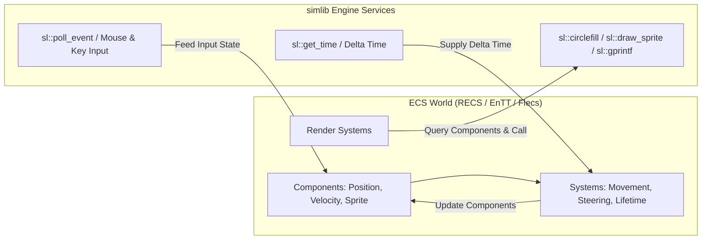

# Using an Entity Component System (ECS) with `simlib`

[← Back to README](../README.md)

`simlib` is an Allegro4-style 2D game framework that provides hardware rendering, windowing, input handling, timing, audio, fonts, shaders, and post-processing.

`simlib` is intentionally **ECS-agnostic**. It does not enforce a specific scene graph, component structure, or object hierarchy. You can pair `simlib` with any Entity Component System library (or custom object model) you prefer—such as [RECS](https://github.com/dave/recs), [EnTT](https://github.com/skypjack/entt), [Flecs](https://github.com/SanderMertens/flecs), or a lightweight custom C++ solution.

---

## Architecture & Separation of Concerns

When using an ECS with `simlib`, maintain a clean separation between game state and engine services:

| Domain | Responsibility | Provided By |
| :--- | :--- | :--- |
| **Entity & Data Management** | Entity creation/destruction, component storage, archetype layout, system queries | Your choice of ECS (e.g., RECS, EnTT, Flecs) |
| **Platform & Presentation** | Windowing, input polling, delta timing, drawing primitives, text, audio, post-processing | `simlib` (`sl::*`) |



---

## Featured Example: `execs`

The repository includes a complete, interactive ECS demonstration app in [`src/examples/execs/`](../src/examples/execs/execs.cpp) using [RECS](src/examples/execs/recs.h).

### Building and Running `execs`

```bash
cmake -S . -B build
cmake --build build --target execs
./build/execs
```

### Controls in `execs`
- **Left Mouse**: Spawn Wanderers at cursor
- **Right Mouse**: Spawn Seekers at cursor
- **Keys `1`, `2`, `3`**: Spawn batch Wanderers, Seekers, or Particles
- **Key `C`**: Toggle chunk-based iteration (`for_each_chunk`)
- **Key `P`**: Toggle parallel iteration (`parallel_for_each`)
- **Key `K`**: Toggle parallel chunk iteration (`parallel_for_each_chunk`)
- **Key `R`**: Reset simulation
- **Escape**: Exit

---

## How to Integrate an ECS with `simlib`

### 1. Define Plain C++ Components
Components store pure data. `simlib` types (such as `sl::Colour` or `sl::Bitmap*`) can be held directly inside component structs:

```cpp
struct Position
{
    float x;
    float y;
};

struct Velocity
{
    float x;
    float y;
};

struct RenderableCircle
{
    float radius;
    sl::Colour colour;
};
```

### 2. Update Systems using `simlib` Input & Timing
In your game loop, query `simlib` for input and delta time, then pass them to your ECS update systems:

```cpp
// Feed simlib delta time into the ECS logic
void movement_system(recs::World& world, float delta_time)
{
    world.for_each<Position, Velocity>(
        [delta_time](Position& pos, const Velocity& vel) {
            pos.x += vel.x * delta_time;
            pos.y += vel.y * delta_time;
        });
}
```

### 3. Render Systems calling `simlib` Drawing Primitives
Render systems iterate over active entities and issue `simlib` drawing calls:

```cpp
void render_system(recs::World& world)
{
    world.for_each<Position, RenderableCircle>(
        [](const Position& pos, const RenderableCircle& circle) {
            sl::circlefill(sl::screen, pos.x, pos.y, circle.radius, circle.colour);
        });
}
```

### 4. Main Game Loop Structure
```cpp
#include "sl.h"
#include "recs.h"

int main(int argc, char** argv)
{
    sl::configure_graphics_backend_from_args(argc, argv);
    if (!sl::set_gfx_mode(sl::GFX_AUTODETECT_WINDOWED, 1200, 800))
        return -1;

    recs::World world;

    // Spawn entities...

    double last_time = sl::get_time();
    bool running = true;

    while (running)
    {
        sl::Event event;
        while (sl::poll_event(&event))
        {
            if (event.type() == sl::Event::Type::quit)
                running = false;
            sl::display_handle_event(event);
        }

        double now = sl::get_time();
        float delta = static_cast<float>(now - last_time);
        last_time = now;

        // 1. Update ECS Systems
        movement_system(world, delta);

        // 2. Render Scene
        sl::clear_to_colour(sl::screen, sl::Colour{18, 28, 42});
        render_system(world);

        // 3. Present Frame
        sl::show_video_bitmap();
        sl::end_frame();
    }

    return 0;
}
```

---

## Interoperability with Other ECS Frameworks

Because `simlib` does not impose any base classes or internal entity registries, integrating other C++ ECS libraries is equally straightforward.

### Example with EnTT
```cpp
#include "sl.h"
#include <entt/entt.hpp>

entt::registry registry;

// Movement System
auto view = registry.view<Position, Velocity>();
for (auto entity : view) {
    auto& pos = view.get<Position>(entity);
    auto& vel = view.get<Velocity>(entity);
    pos.x += vel.x * delta;
    pos.y += vel.y * delta;
}

// Render System
auto render_view = registry.view<Position, RenderableCircle>();
for (auto entity : render_view) {
    const auto& pos = render_view.get<Position>(entity);
    const auto& circle = render_view.get<RenderableCircle>(entity);
    sl::circlefill(sl::screen, pos.x, pos.y, circle.radius, circle.colour);
}
```

### Example with Flecs
```cpp
#include "sl.h"
#include <flecs.h>

flecs::world ecs;

ecs.system<Position, Velocity>("Move")
   .each([](Position& pos, const Velocity& vel) {
       pos.x += vel.x * ecs.delta_time();
       pos.y += vel.y * ecs.delta_time();
   });

ecs.system<Position, RenderableCircle>("Render")
   .each([](const Position& pos, const RenderableCircle& circle) {
       sl::circlefill(sl::screen, pos.x, pos.y, circle.radius, circle.colour);
   });
```

`simlib` gives you complete freedom to structure your application architecture, entity pipeline, and data layouts however best fits your project.
