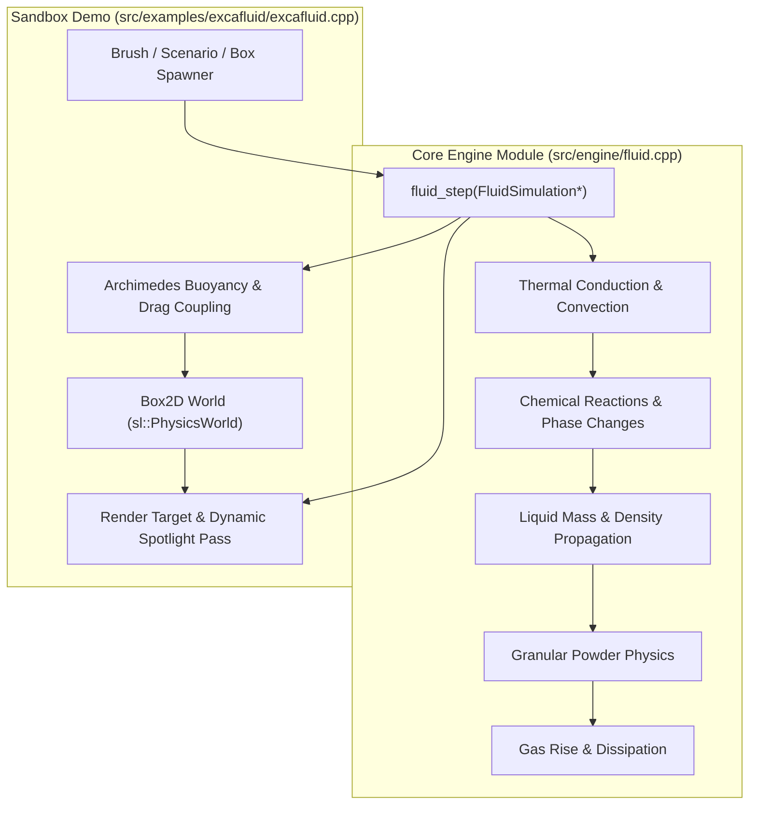

# `excafluid` Cellular Automata Fluid & Physics Sandbox Guide

[← Back to README](../README.md)

https://github.com/user-attachments/assets/81a93445-babe-4a3d-be93-2abe296d62f5

`excafluid` ([src/examples/excafluid/excafluid.cpp](../src/examples/excafluid/excafluid.cpp)) is an interactive sandbox simulation combining a multi-material **Cellular Automata (CA)** fluid engine ([src/engine/fluid.cpp](../src/engine/fluid.cpp)) with **Box2D rigid-body physics** and **2D dynamic spotlight illumination**.

It implements the compressible fluid and physical modeling principles described in Tom Forsyth's *Cellular Automata for Physical Modelling*, supporting 14 distinct materials, thermodynamic heat conduction, chemical phase changes, Archimedes buoyancy coupling, explosive pressure waves, and dynamic lighting.

---

## Architecture Overview

---

## 1. Cellular Automata Engine & Elements

The engine simulates a grid of cells ($200 \times 150$ scaled $4\times$ to $800 \times 600$) with 14 materials:

| Element | Density | Phase | Properties & Interactions |
| --- | --- | --- | --- |
| **Empty** | `0.0` | Vacuum | Displaceable air. |
| **Solid** | `999.0` | Solid | Indestructible bedrock and container boundary walls. |
| **Wood** | `0.7` | Solid | Flammable structural material; burns into fire and smoke when heated past $220^\circ\text{C}$. |
| **Sand** | `1.8` | Powder | Granular falling powder; displaces lighter liquids (water, oil) and forms angle-of-repose mounds. |
| **Water** | `1.0` | Liquid | Compressible liquid; extinguishes fire, boils into steam upon contact with lava, floats below oil. |
| **Oil** | `0.65` | Liquid | Highly flammable liquid; floats on top of water ($\text{density} = 0.65$), ignites at $75^\circ\text{C}$. |
| **Acid** | `1.25` | Liquid | Corrosive liquid; dissolves wood, plants, and sand while bubbling into smoke. Sinks below water. |
| **Lava** | `2.4` | Liquid | Molten rock at $1000^\circ\text{C}$; ignites flammables, boils water into steam, and solidifies into stone. |
| **Gunpowder** | `1.6` | Powder | Explosive granular material; detonates upon contact with heat or fire, generating blast waves. |
| **Plant** | `0.5` | Organic | Organic matter; consumes adjacent water to sprout upward, highly flammable ($160^\circ\text{C}$). |
| **Pump** | `999.0` | Mechanical | Active mechanism that propels fluids upward against gravity. |
| **Fire** | `-0.2` | Plasma | High-temperature flame ($650^\circ\text{C}$); radiates heat upward, ignites fuel, dissipates into smoke. |
| **Smoke** | `-0.1` | Gas | Low-density rising gas with a finite lifetime; dissipates in open air. |
| **Steam** | `-0.15` | Gas | High-temperature rising gas created when water boils against lava or fire. |

---

## 2. Thermodynamics & Chemical Reactions

1. **Thermal Conduction & Convection**:
   - Each cell tracks temperature in Celsius ($\text{ambient} = 20^\circ\text{C}$).
   - Heat radiates bidirectionally with upward convective bias (weights: `[0.40 top, 0.15 left, 0.15 right, 0.05 bottom]`).
   - Materials naturally cool back toward ambient temperature over time.

2. **Phase Changes & Reactions**:
   - **Water + Lava** $\rightarrow$ **Stone (Solid)** + high-pressure **Steam**.
   - **Acid + Wood / Plant / Sand** $\rightarrow$ **Smoke** (corrodes material).
   - **Fire / Heat ($>200^\circ\text{C}$) + Gunpowder / TNT** $\rightarrow$ **Explosion** (radial pressure wave destroying weak materials and blasting physics bodies).
   - **Water + Plant** $\rightarrow$ **Plant Growth** (branches upward into free space).

---

## 3. Box2D Rigid-Body Coupling (Archimedes Buoyancy)

`excafluid` couples the grid-based fluid simulation with continuous Box2D rigid bodies:

1. **Submersion Sampling**:
   Each frame, the bounding box of every dynamic Box2D body is sampled against the underlying cellular grid:

   $$
   \text{submerged\_ratio} = \frac{\text{cells}_{\text{liquid}}}{\text{cells}_{\text{total}}}
   $$

2. **Archimedes Buoyancy Force**:

   $$
   \mathbf{F}_{\text{buoyancy}} = \text{submerged\_ratio} \cdot \bar{\rho}_{\text{fluid}} \cdot (\text{width} \cdot \text{height} \cdot g) \cdot \mathbf{\hat{j}}
   $$

   - Wooden crates ($\rho = 0.45$) float stably on water and oil.
   - Metal barrels ($\rho = 2.4$) sink in water and float only in dense lava.
   - Crates bob and equalize realistically in U-tube channels.

3. **Fluid Drag & Displacement**:
   - Moving rigid bodies apply opposing drag forces proportional to velocity and submersion.
   - Fast-moving bodies displace adjacent fluid cells horizontally to create wakes.

---

## 4. Preset Scenarios

Press **`P`** to cycle through 5 scenarios:

- **Scenario 1: U-Tube Hydraulic Equalization**: Compressible water and floating oil layers demonstrate hydrostatic pressure equalization across communicating vessels with floating wooden crates.
- **Scenario 2: Volcano & Steam Geysers**: Molten lava crater overflowing into a mountain lake, turning water into rising steam and burning wooden bridges.
- **Scenario 3: Bomb Testing Ground & TNT**: Multi-level wooden fortress packed with gunpowder caches, oil reservoirs, and TNT crates ready for chain reactions.
- **Scenario 4: Hydroelectric Pump & Seesaw**: Upper hopper draining water across a balanced rigid seesaw, collected in a lower catch basin.
- **Scenario 5: Acid Rain & Overgrown Jungle**: Acid reservoir situated high above lush plant terraces and wooden platforms, corroding structures in real time.

---

## 5. Controls & Keybindings

| Key | Action |
| --- | --- |
| **`1` – `9`, `0`, `-`** | Select element (Sand, Water, Oil, Acid, Lava, Gunpowder, Plant, Fire, Wood, Pump, Smoke, Steam) |
| **Left Click** | Paint selected element with brush |
| **Right Click** | Erase cells (replace with Empty) |
| **`[` / `]`** | Decrease / increase brush radius |
| **`C`** | Spawn dynamic Wooden Crate |
| **`V`** | Spawn dynamic Metal Barrel |
| **`T`** | Spawn dynamic TNT Bomb |
| **`P`** | Cycle preset scenario (1 through 5) |
| **`B`** | Toggle Bloom glow effect |
| **`L`** | Toggle 2D Dynamic Spotlight (torch following mouse) |
| **`Space`** | Pause / resume simulation |
| **`R`** | Reset / clear grid |

---

[← Back to README](../README.md)
