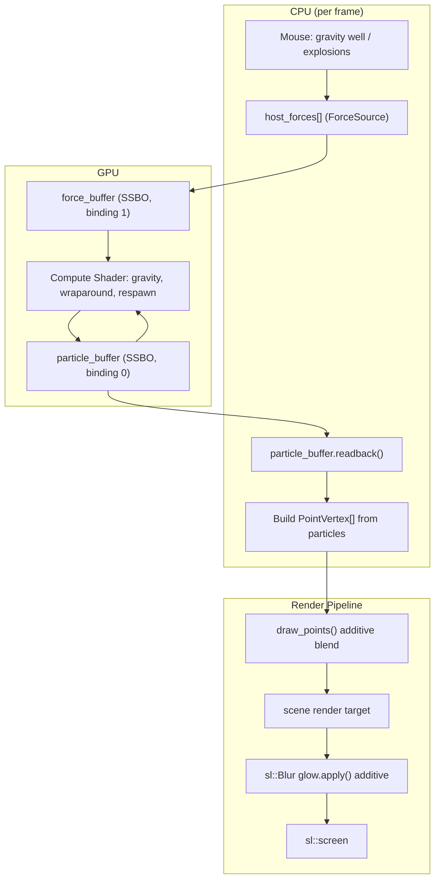

# `exgpuparticles` GPU Compute Particles Guide

[← Back to README](../README.md)

`exgpuparticles` ([src/examples/exgpuparticles/exgpuparticles.cpp](../src/examples/exgpuparticles/exgpuparticles.cpp)) simulates 150,000 particles entirely on the GPU using a compute shader and `sl::StorageBuffer`, then renders them as additively-blended points with a soft `sl::Blur` glow. It builds on the minimal [`excompute`](../src/examples/excompute/excompute.cpp) example by adding interactive forces, cross-backend compute shader uniforms, and a full render pipeline.

---

## Architecture Overview



---

## 1. Particle & Force Data Layout

Both the host (`GpuParticle`, `ForceSource`) and compute shader (`Particle`, `Force`) structs use a matching flat-`float` layout so they line up under `std430` without manual padding:

```cpp
struct GpuParticle { float x, y, vx, vy, r, g, b, life; };
struct ForceSource  { float x, y, strength, radius; };
```

A `ForceSource` with negative `strength` acts as a gravity well (pulls particles in); positive `strength` acts as an explosion impulse (pushes particles out). Up to `MAX_FORCES` (16) force sources are uploaded to `force_buffer` every frame — slot 0 is the mouse-held gravity well, the rest are active explosions.

## 2. Compute Simulation

The compute shader (`local_size_x = 256`) runs once per particle per frame and:

1. Accumulates acceleration from every active force (`1/dist²`-style falloff, `dist² + 400` to avoid singularities at the force centre).
2. Integrates velocity/position, applies light damping (`vel *= 0.994`), and wraps particles that leave the screen bounds back around to the opposite edge.
3. Ages `life` down over time; when a particle's `life` reaches zero it respawns at a new hashed-random position/velocity/colour (`hash11`, a cheap fract-based PRNG) rather than being removed, keeping the particle count constant.

## 3. Cross-Backend Compute Uniforms

Vulkan's GLSL profile rejects loose `uniform` globals in compute shaders ("non-opaque uniforms outside a block"), while OpenGL is fine with them. `exgpuparticles` ships **two** compute shader sources — `compute_shader_src` (GL, plain `uniform` globals) and `compute_shader_src_vulkan` (identical logic, but the same values are grouped into a `layout(push_constant) uniform Params { ... }` block) — and picks the right one at startup based on `sl::graphics_backend()`:

```cpp
const bool is_vulkan = sl::graphics_backend() == sl::GraphicsBackend::vulkan;
const bool compute_loaded = is_vulkan
    ? compute_shader.load_compute(compute_shader_src_vulkan, compute_vulkan_uniforms)
    : compute_shader.load_compute(compute_shader_src);
```

`compute_vulkan_uniforms` is a `std::vector<sl::ShaderUniform>` mapping each push-constant field name to its byte offset/size, so `Shader::set_uniform(name, value)` works identically for callers regardless of backend.

## 4. Dispatch & Readback

Each frame: bind the compute program, bind both storage buffers, push the per-frame uniforms (`uDeltaTime`, `uWidth`, `uHeight`, `uForceCount`, `uSeed`), dispatch one thread per particle, then insert a `sl::compute_barrier()` before reading the updated buffer back to the CPU with `particle_buffer.readback()`. The CPU copy is only used to build the `PointVertex` array for rendering — the simulation itself never leaves the GPU.

> Vulkan requires a frame to already be active before compute dispatch, and the compute program must be `use()`d before binding storage buffers (bindings are recorded against whichever program is currently active). `exgpuparticles` opens the `scene` render target *before* dispatching compute for this reason — see the comments in `main()`.

## 5. Rendering & Glow

Particles are drawn with `sl::draw_points()` under `BlendMode::additive` so overlapping particles brighten rather than occlude each other. The sharp point cloud is captured into a `scene` render target, then composited onto the screen twice: once normally (crisp particles) and once through `sl::Blur` under additive blending (a soft halo). `B` toggles the glow pass on/off at runtime to compare the two.

---

## Controls

| Input | Effect |
| --- | --- |
| Left click / drag | Gravity well at the mouse position |
| Right click | Spawn an explosion impulse that fades out over ~0.7s |
| `B` | Toggle the additive glow pass |
| `Escape` | Exit |

---

## See Also

- [`excompute`](../src/examples/excompute/excompute.cpp) — the minimal single-force version this example builds on.
- [Graphics Effects & 2D Lighting](graphics_effects.md) — `sl::Blur` and the other post-process effects.
- [API Reference](api_reference.md) — `StorageBuffer`, `dispatch_compute_for`, `draw_points`, `set_blend_mode`.
