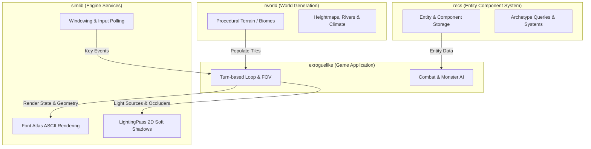

# `exroguelike` ASCII Roguelike Architecture Guide

[← Back to README](../README.md)

`exroguelike` ([src/examples/exroguelike/exroguelike.cpp](../src/examples/exroguelike/exroguelike.cpp)) is a complete turn-based ASCII roguelike built using `simlib` for hardware-accelerated rendering and windowing, alongside independent modular libraries for entity management ([`recs`](../src/examples/exroguelike/recs.h)) and procedural world generation ([`rworld`](../src/examples/exroguelike/rworld.h)).

---

## Decoupled Architectural Philosophy

A core design principle of `simlib` is **non-intrusive modularity**. `simlib` does not impose a scene graph, entity hierarchy, or world model. Likewise, game logic libraries like `recs` and `rworld` do not depend on graphics, windowing, or audio engines.



### Modular Separation of Concerns

| Library | Role | Dependencies |
| :--- | :--- | :--- |
| **`simlib`** | Hardware rendering, event polling, 2D tile lighting, font atlases, and frame pacing | SDL2, OpenGL/Vulkan |
| **`recs`** | Header-only Entity Component System (entities, components, archetype memory, systems) | Standard C++17 only |
| **`rworld`** | Header-only procedural overworld and biome generation | Standard C++17 only |
| **`exroguelike`** | Game glue: connects user input to ECS updates, world generation, FOV, and `simlib` render calls | C++17, `simlib`, `recs`, `rworld` |

Neither `recs` nor `rworld` contains any graphics code, and `simlib` contains no entity or world-generation logic. You are free to swap any layer out (e.g. replacing `recs` with EnTT or `rworld` with custom noise) without modifying `simlib`.

---

## Major Features in `exroguelike`

- 🗺️ **512 × 512 Overworld**: Procedural biomes, deep ocean, beaches, plains, forests, mountains, and scattered dungeon entrances.
- 🏰 **Multilevel 3×3 Sector Dungeons**: Up to 9 connected rooms per level with corridors, crypts, temples, torches, braziers, and staircases.
- 👁️ **Bresenham Line-of-Sight FOV**: Fog-of-war tracking for explored vs. currently visible tiles.
- 💡 **2D Dynamic Tile Lighting & Shadows**: Real-time radial lights, spotlights, priority candidate scoring, and wall shadow casters powered by `simlib`'s `LightingPass`.
- ⚔️ **Turn-Based Combat & Monster AI**: Melee combat, health tracking, messaging log, and directional monster pathing.
- ⚡ **Event-Driven Pacing**: Zero CPU overhead when idle between turns.

---

## Building and Running

```bash
cmake -S . -B build
cmake --build build --target exroguelike
./build/exroguelike
```

You can select a specific backend using command line flags:
```bash
./build/exroguelike --gl      # Run using OpenGL 4.3
./build/exroguelike --vulkan  # Run using Vulkan
```

### Controls

| Action | Controls |
| :--- | :--- |
| **Move / Attack** | `HJKL` / Arrow Keys / Numpad (`1`-`9`) |
| **Wait Turn** | `.` or Numpad `5` |
| **Use Stairs / Enter** | `>` or `Enter` |
| **Ascend Stairs** | `<` |
| **Quit** | `Escape` |

---

## Technical Walkthrough

### 1. Rendering Coloured ASCII Characters
`exroguelike` maps each grid cell to a `sl::textout` call using `simlib`'s monospace font atlas:

```cpp
static void draw_cell(int cell_x, int cell_y, char character, const sl::Colour& foreground, const sl::Colour& background)
{
    int pixel_x = MAP_X + cell_x * CELL_WIDTH;
    int pixel_y = MAP_Y + cell_y * CELL_HEIGHT;

    if (background.red != 0 || background.green != 0 || background.blue != 0) {
        sl::rectfill(sl::screen, pixel_x, pixel_y, pixel_x + CELL_WIDTH - 1, pixel_y + CELL_HEIGHT - 1, background);
    }

    if (character != ' ') {
        char text[2] = { character, '\0' };
        sl::textout(g_font, pixel_x + 1, pixel_y, foreground, text);
    }
}
```

### 2. 2D Tile Lighting and Shadow Occlusion
Light sources (player torch, dungeon torches, braziers, crystal spotlights) are scored by proximity and submitted to `simlib`'s `LightingPass`:

```cpp
auto lights = build_simlib_lights(game);
auto casters = build_simlib_shadow_casters(game);

// Apply ambient + radial lighting and wall soft shadows to the scene
lighting_pass.apply(scene, lights, MAP_X, MAP_Y, MAP_WIDTH * CELL_WIDTH, MAP_HEIGHT * CELL_HEIGHT, casters);
```

### 3. Turn-Based Pacing (Zero Idle CPU Usage)
The main loop waits for user events and only recalculates FOV, lighting, and frame rendering when a turn is executed:

```cpp
while (running)
{
    sl::Event event;
    bool player_acted = false;

    while (sl::poll_event(&event)) {
        if (handle_input(game, event)) player_acted = true;
        sl::display_handle_event(event);
    }

    if (player_acted) {
        advance_turn(game);
        update_fov(game);
        build_lights(game);
        dirty = true;
    }

    if (dirty) {
        // Render frame...
        sl::show_video_bitmap();
        sl::end_frame();
        dirty = false;
    } else {
        sl::rest(10); // Sleep while idle to consume 0% CPU
    }
}
```

---

[← Back to README](../README.md)
