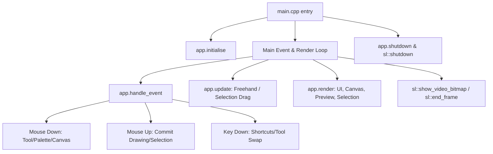

# `slpaint` Retro Paint Application Architecture Guide

[← Back to README](../README.md)

`slpaint` ([src/examples/slpaint/slpaint.cpp](../src/examples/slpaint/slpaint.cpp)) is a self-contained, immediate-mode pixel art and graphics editor built on `simlib`. It demonstrates RAM-to-GPU bitmap synchronization, multi-level undo/redo, floating selection buffers, interactive shape previews, and responsive software-assisted drawing tools.

---

## Application Architecture

The application is structured inside a clean, self-contained `PaintApp` class that processes inputs, updates interactive tool previews, and renders GUI controls, canvas buffers, and floating selections each frame:

---

## Component Walkthrough

### 1. Canvas & Bitmap Memory Model
- **`canvas` (`sl::Bitmap*`)**: A dedicated $800 \times 600$ RAM/GPU bitmap. Drawing tools modify RAM pixels directly or rasterize shapes onto the bitmap, and `sl::upload_bitmap(canvas)` synchronizes modifications to the GPU for rendering.
- **Coordinate Space Conversion**: `screen_to_canvas(mx, my, cx, cy)` maps screen window coordinates into canvas-relative pixel coordinates ($0 \le cx < 800, 0 \le cy < 600$).

### 2. Tools & Rasterization Pipeline

| Tool | Implementation & Drawing Logic |
| --- | --- |
| **Pencil (`Tool::Pencil`)** | Direct single-pixel Bresenham line rasterization (`sl::line`) across consecutive mouse samples. |
| **Brush (`Tool::Brush`)** | Variable-thickness disc stamping along interpolated lines (`sl::circlefill` at `brush_size * 0.5f`). |
| **Eraser (`Tool::Eraser`)** | Discs stamped using the current background colour. |
| **Line (`Tool::Line`)** | Interactive preview while dragging; commits a line with thickness (`sl::line`) on mouse release. |
| **Rectangle (`Tool::Rectangle`)** | Outline (`sl::rect` with thickness) or filled (`sl::rectfill`) rectangle. |
| **Ellipse (`Tool::Ellipse`)** | Outline (`sl::ellipse` with thickness) or filled (`sl::ellipsefill`) ellipse. |
| **Flood Fill (`Tool::Fill`)** | Fast 4-way queue-based flood fill (`sl::flood_fill`) starting from the clicked pixel coordinate. |
| **Colour Picker (`Tool::Picker`)** | Reads pixel colour (`sl::getpixel`) under cursor and assigns it to foreground (LMB) or background (RMB). |
| **Selection (`Tool::Select`)** | Rectangular marquee selection, floating cut/copy buffer manipulation, and interactive repositioning. |

### 3. Undo / Redo History Stack
- **Snapshot Model**: Before any drawing operation begins (`begin_drawing`, `begin_selection`, `flood_fill`, `new_document`), `snapshot()` pushes the current canvas pixel vector to `undo_stack`.
- **Memory Management**: The history is capped at `MAX_UNDO` (30 frames, $\approx 57 \text{ MB}$). Performing an action clears the `redo_stack`.
- **Keyboard Shortcuts**: `Ctrl+Z` (Undo) and `Ctrl+Y` (Redo).

### 4. Floating Selection & Clipboard
- **Marquee Drag**: Dragging with `Tool::Select` defines a bounding box (`selection_rect`).
- **Floating Buffer (`selection`)**: Sub-bitmap extracted via `sl::create_sub_bitmap()`. The canvas region beneath the selection is cleared to the background colour.
- **Moving Selection**: Dragging inside the selection marquee updates `selection_rect` coordinates dynamically without modifying the underlying canvas until committed.
- **Commit / Cancel**: Clicking outside or switching tools commits the floating selection into the canvas (`sl::blit`). Pressing `Escape` cancels and restores the canvas from `selection_before`.
- **Clipboard Operations**: `Ctrl+C` (Copy to clipboard), `Ctrl+X` (Cut to clipboard), and `Ctrl+V` (Paste as new floating selection).

### 5. Toolbar & User Interface
- **Left Control Panel**: Tool selection buttons, size selector (`1px`, `2px`, `4px`, `8px`, `16px`), shape fill/outline toggle, and file actions (New, Save, Load).
- **Classic 32-Colour Palette**: 16 primary + 16 secondary colours arranged in a dual-row palette. LMB selects foreground; RMB selects background.
- **Bottom Status Bar**: Displays current active tool, tool status messages, coordinates, and hotkey hints.
- **Live Preview Overlay**: `draw_preview()` renders semi-transparent vector previews of lines, rectangles, and ellipses over the screen during drag gestures before committing to pixels.

---

## Key Shortcuts Reference

- **Tools**: `P` (Pencil), `B` (Brush), `E` (Eraser), `L` (Line), `R` (Rectangle), `O` (Ellipse), `F` (Fill), `I` (Picker), `S` (Select)
- **Size / Thickness**: `1`–`5` presets, `[` / `-` decrease, `]` / `+` / `=` increase
- **File & Edit**: `Ctrl+Z` (Undo), `Ctrl+Y` (Redo), `Ctrl+N` (New), `Ctrl+S` (Save PNG), `Ctrl+C` (Copy), `Ctrl+X` (Cut), `Ctrl+V` (Paste), `Esc` (Cancel Selection)

---

[← Back to README](../README.md)
