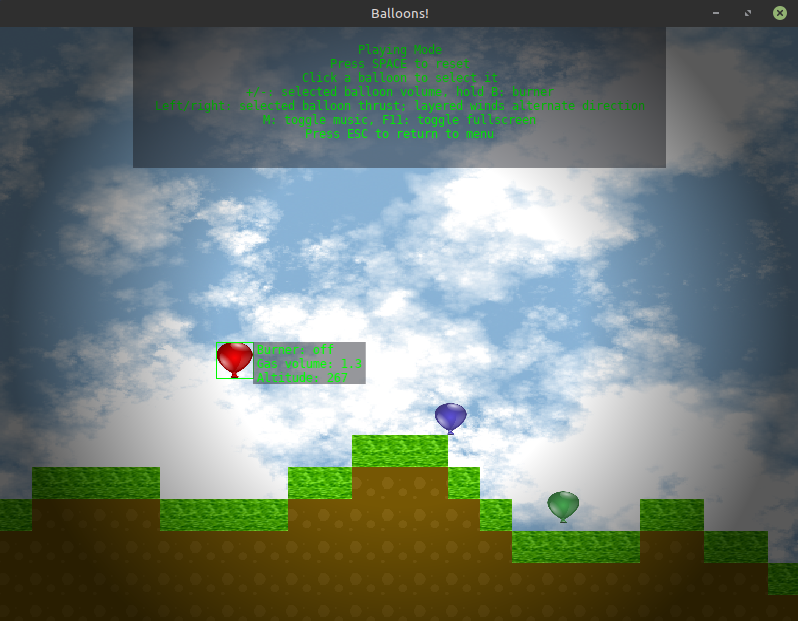
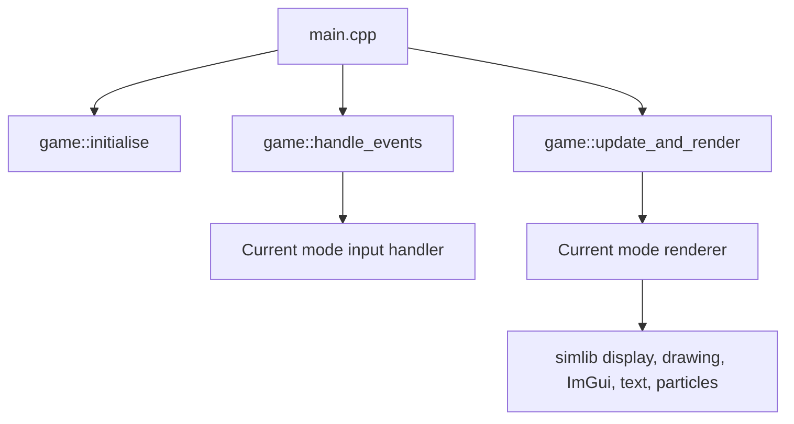

# `sltest` Sample Game Architecture Guide

[← Back to README](../README.md)

`sltest` demonstrates how to structure a complete 2D game application using `simlib` services without heavyweight framework dependencies.

---

## Architecture Overview

Game flow is organized around a simple `Mode` state machine. Each screen implements input handling and per-frame update/render functions:

---

## Source Structure

- **[`main.cpp`](../src/examples/sltest/main.cpp)**: Executable entry point, game loop, and lifecycle orchestration.
- **[`game.h`](../src/examples/sltest/game.h)**: Shared screen interface (`Mode::menu`, `Mode::playing`, `Mode::settings`, `Mode::lua_console`, etc.).
- **[`game.cpp`](../src/examples/sltest/game.cpp)**: Window setup, audio initialization, event dispatching, and shutdown coordination.
- **[`game_menu.cpp`](../src/examples/sltest/game_menu.cpp)**: Main menu navigation with Dear ImGui integration.
- **[`game_playing.cpp`](../src/examples/sltest/game_playing.cpp)**: Main physics gameplay, particle emitters, lighting pass, and balloon entities.
- **[`entity.cpp`](../src/examples/sltest/entity.cpp)**: Particle physics, integration, AABB/circle collision response, and rendering.
- **[`game_lua.cpp`](../src/examples/sltest/game_lua.cpp)**: Interactive in-game Lua REPL console with scrollback text cache.
- **[`game_settings.cpp`](../src/examples/sltest/game_settings.cpp)** / **[`game_help.cpp`](../src/examples/sltest/game_help.cpp)** / **[`game_paused.cpp`](../src/examples/sltest/game_paused.cpp)**: Modal screens and UI widgets.

---

[← Back to README](../README.md)
